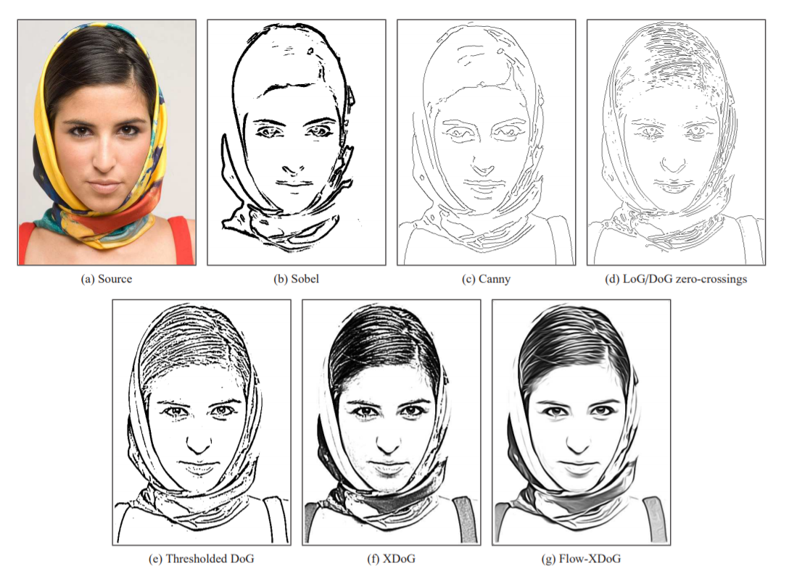
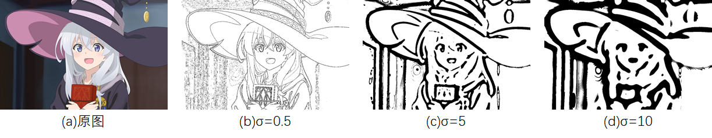
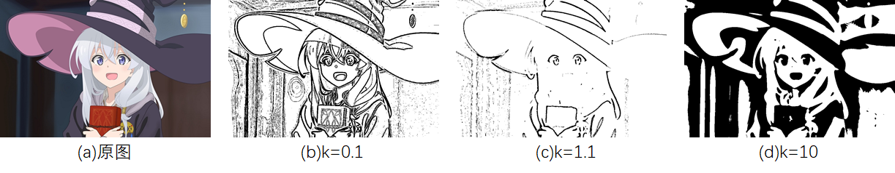
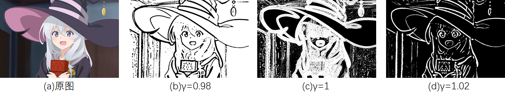
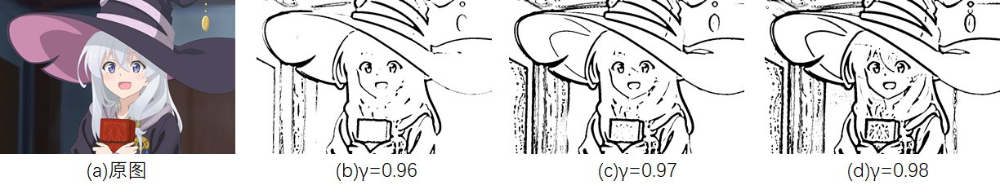
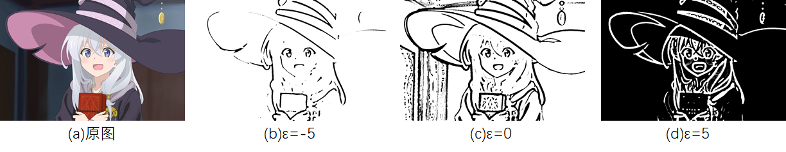
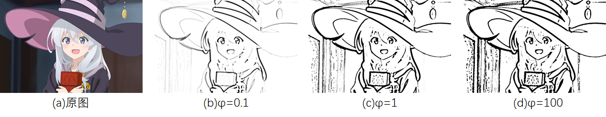

# 1 基本信息

## 1.1 论文基本信息

**论文题目**：XDoG: An eXtended difference-of-Gaussians compendium including advanced image stylization

**论文地址**：https://www.sciencedirect.com/science/article/abs/pii/S009784931200043X

**发布时间**：2012年10月

# 2 问题提出

**问题起因**：DoG(difference-of-gaussians)是一个生成边缘图片的算法。作者发现很多论文为了提取边缘不仅仅使用DoG算法，还额外添加了很多复杂的过程。作者认为这些是没有必要的，这些复杂的过程都可以等效为一种DoG。因此作者对DoG进行拓展，发表了XDoG（eXtended difference-of-gaussians）。说白就是作者改进了DoG。

**作者思路**：作者对DoG的改进比较关键的一点是为了加宽边缘，采用阈值进行范围判断而不是取梯度为0之类的点。并且额外添加参数控制。

# 3 现有边缘提取方法与问题

## 3.1 现有方法及其问题

**(a)Canny算法**：使用基于梯度的方法进行边缘提取。问题是对噪声敏感，并且生成边缘图的边缘线宽度往往是只有1~2个像素。这很不合理一般的边缘图片不应该是这么细的。

**(b)LoG（Laplacian of Gaussian）**：对高斯卷积核使用拉普拉斯算子后再对图片进行卷积。问题是产生的边缘性宽度还是1个像素左右，不合理，并且计算效率比较低。

LoG用公式描述就是
$$
LoG=\nabla^2(G*I)=(\nabla^2G)*I
$$
其中$I$是图片，$G$是高斯卷积核。

## 3.2 DoG算法

### 介绍

对于LoG中计算速度慢的问题，使用DoG可以解决。DoG使用两个图片的高斯差分图来进行边缘检测。

上图是使用不同的方法对原图片(a)处理的结果

第一行是使用梯度的方法，选取图形梯度为0（或二阶导数）的点组成的边缘图片，可以发现是边缘为线状并且受到噪声影响比较大。

### 算法流程

1. 对于图片$I$，设定高斯卷积核的方差$\sigma$和放缩比率$k$。
2. 对$I$，使用高斯滤波器$G_\sigma$进行卷积，得到$g_1$
3. 对$I$，使用高斯滤波器$G_{k\sigma}$进行卷积，得到$g_2$
4. $g_1-g_2$得到高斯差分图
5. 取差分图中为0的地方得到边缘图片

**DoG相对于LoG加速原理**

假设图像为$I(x)$，表示在坐标$x$处，灰度值是$I(x)$。使用两个不同$\sigma$的高斯卷积核，对图片$I$进行卷积操作。有
$$
g_1(x)=G(x,\sigma_1)*I(x)\\
g_2(x)=G(x,\sigma_2)*I(x)
$$
其中$*$代表卷积。

那么DoG就是两个不同高斯核卷积卷积结果的差
$$
DoG=g_1 - g_2 = G(x,\sigma_1) * I(x) - G(x,\sigma_2) * I(x)
$$
而对于导数定义有
$$
\frac{\part G}{\part \sigma} = \lim_{\Delta\sigma \rightarrow0 }\frac{G(x,\sigma +\Delta\sigma)-G(x,\sigma)}{\Delta\sigma}
$$
若设$k\sigma = \sigma + \Delta \sigma$，当$k\rightarrow 1$时，近似有
$$
\frac{\part G}{\part \sigma} \approx \frac{G(x,k\sigma)-G(x,\sigma)}{(k-1)\sigma}
$$
代入DoG的公式，也就是令$\sigma_1=k\sigma,\sigma_2 = \sigma$
$$
DoG = G(x,\sigma_1)-G(x,\sigma_2)\approx (k-1)\sigma_2 \frac{\part G}{\part \sigma_2}
$$
而对于高斯函数对$\sigma$求偏导有
$$
\frac{\part G}{\part \sigma}=\frac{-2\sigma^2+x^2}{2\pi\sigma^5}exp(-\frac{x^2}{2\sigma^2})=\sigma \nabla^2G
$$
所以
$$
DoG\approx(k-1)\sigma^2\nabla^2G
$$
与LoG很相似，所以用DoG来近似代替LoG，进而加速计算。

# 4 XDoG算法

### 改进之处

xDoG对DoG中差分图和阈值添加新的参数来控制。

如上图，为了修正边缘处只有一两个像素的问题，使用了阈值的方法去做边缘判定
$$
T_{\epsilon}(u) =
\left\{\begin{array}{l} 
  1 &u\ge\epsilon\\  
  0 & u<\epsilon
\end{array}\right.
$$
第二行的(e)是应用阈值处理后的图片，可以发现效果明显比(d)好多了。同时为了更强的适应性，可以把阈值函数进行拓展，如下。

使用改进的阈值函数
$$
T_{\epsilon,\varphi}(u) =
\left\{\begin{array}{l} 
  1 &u\ge\epsilon\\  
  1 + tanh(\varphi \cdot (u - \epsilon)) & u<\epsilon
\end{array}\right.
$$
其中$\epsilon，\varphi$是参数，$u$是高斯差分图中每个像素点的灰度值，1是白色，0是黑色。这样当$\varphi\rightarrow \infin$时，也可以近似看作阶梯的二元函数。

扩展高斯差分，在高斯差分图中新加参数$\gamma$来控制高斯差分图
$$
D_{\sigma,k,\gamma}=G_{\sigma}(x)-\gamma G_{k\sigma}(x)
$$
其中$\sigma,k,\gamma$是控制的参数

论文中还写为了方便参数控制，高斯差分还可以写为
$$
S_{\sigma,k,p}=\frac{D_{\sigma,k,\gamma}(x)}{\gamma-1}=(1+p)G_{\sigma}(x)-p G_{k\sigma}(x)
$$
总结：在xDoG中参数共有$\sigma,k,\gamma,\epsilon,\varphi$，根据不同的差分形式，也有可能没有$\gamma$而是有$p$

参数说明

+ $\epsilon$一般选取图片中间灰度值
+ p，接近20的值效果不错
+ $\varphi$，较小时对细节比较敏感。
+ $\sigma$，较大时会忽略细节，边缘变粗

### 算法流程

1. 对于图片$I$，设定高斯卷积核的方差$\sigma$和放缩比率$k$。
2. 对$I$，使用高斯滤波器$G_\sigma$进行卷积，得到$g_1$
3. 对$I$，使用高斯滤波器$G_{k\sigma}$进行卷积，得到$g_2$
4. $g_1-\gamma g_2$得到高斯差分图
5. 根据阈值函数得到边缘图片

### 实验

在DoG算法中，有参数$\sigma,k,\gamma,\epsilon$下面对这几个参数分别进行测试

**1）对比σ对xDoG的影响**

其余参数$k=1.6，\gamma=0.98，\epsilon=0.1,\varphi=100$。

可以发现σ越大得到的边缘越粗，结果越抽象

**2)对比k对xDoG的影响**

其余$\sigma=3，\gamma=0.98，\epsilon=0.1, \varphi=100$。

当$k\rightarrow0$时，得到图片会尽可能保留细节，并且边缘较细。

当$k\rightarrow 1$时，两张高斯图片比较接近，对于一些不太明显的边缘就被忽略了。

当$k\rightarrow \infin$时，图片会忽略细节，并且边缘交粗。

作者在文中说$k=1.6$时通常效果比较好

**3)对比γ对xDoG的影响**

其余$\sigma=3，k=1.6，\epsilon=0.1，\varphi=100$

发现$\gamma$这个参数比较敏感，不能在个位数级别进行调整。

当$\gamma<1$时，边缘为黑色。

当$\gamma>1$时，边缘为白色。

又可以发现当$\gamma$越接近1，边缘越粗，同时也会更受到噪声影响。

**4)对比ε对xDoG的影响**

论文中描述$\epsilon$一般是取中间值。由于阈值判断直接和$\epsilon$相关联，$\epsilon$是在高斯差分图中的阈值。

其余$\sigma=3，k=1.6，\gamma=0.98，\varphi=100$

同时本张图片的高斯差分图的统计数据为

| min    | max   | mean |
| ------ | ----- | ---- |
| -41.18 | 43.60 | 2.05 |

这个主要影响到的是取内外边缘，和对噪声的过滤能力。

$\epsilon$越大，也就是通过阈值的条件越苛刻，图中黑色越多。并且$\epsilon$越接近最大值或最小值，边缘细节越少。

**5)对比φ对xDoG的影响**

其余$\sigma=3，k=1.6，\gamma=0.98，\epsilon=0.1$

当$\varphi$较小时，有渐变的过程，当$\varphi$较大时，基本为二值图片。

边缘提取，对于人物来说要尽量避免受到阴影的影响，并且要忽视背景。经过我的尝试当参数为$\sigma=1,k=1.6,\gamma=0.98,\epsilon=-1.3,\varphi=5$时效果比较不错

